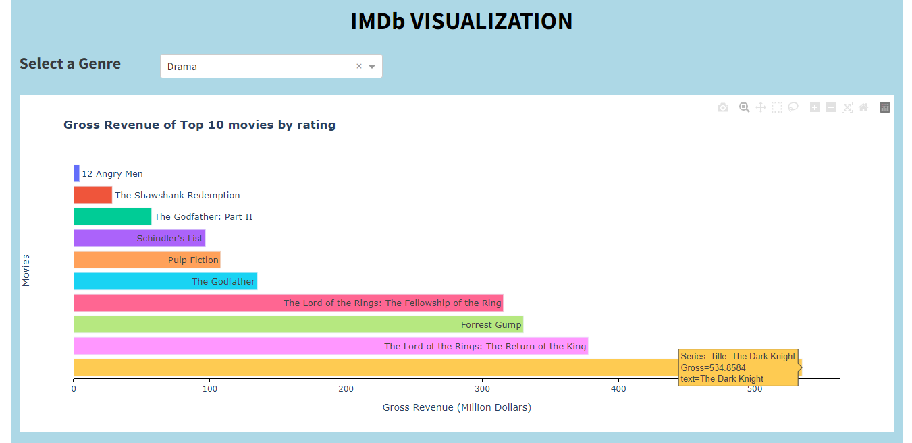
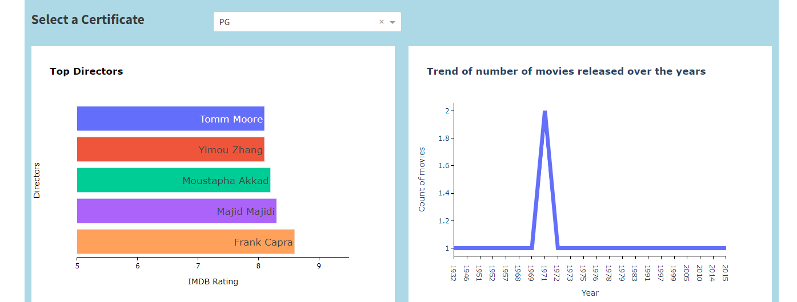

# IMDb Visualization

Welcome and thank you for visiting the `imdb-viz` project repository!

If you love great movies and need some help figuring out which one to watch next, then you've come to the right place as our app is exactly what you need!

[Link to the imdb-viz app](https://imdb-viz-app.onrender.com)

To read more about our app, feel free to jump over to one of the sections below or continue scrolling down.

- [Motivation and Purpose](#motivation-and-purpose)
- [Proposal](#proposal)
- [Dashboard Description](#dashboard-description)
- [Usage](#usage)
- [Description of the data](#description-of-the-data)
- [Contributing](#contributing)
- [License](#license)

## Motivation and Purpose

Choosing a good movie to watch can be a struggle sometimes and there's almost nothing worse than realizing you just spent 2 hours sitting through a horrible movie that you didn't enjoy one bit. Our user-friendly and accessible dashboard aims to help movie enthusiasts avoid this problem by helping them discover and explore new movies based on their movie watching preferences. In addition, our dashboard uses a vast database of movies to provide users with information on ratings, gross revenue, directors and movie numbers presented through engaging visuals based on metrics which they can select via an interactive and intuitive interface. This dash app was built as an extension of our R [shiny app](https://arjunrk.shinyapps.io/IMDB_Viz_R/).

## Proposal

Click [here](https://github.com/UBC-MDS/IMDB_Viz_R/blob/main/reports/proposal.md) to read the initial motivation and purpose of this dashboard.

## Dashboard Description

Our dashboard showcases interactive visualizations which recommend top-rated movies for movie enthusiasts and can assist them in exploring top directors in the movie industry and the trend of the number of movies produced over the years. This dashboard contains a single landing page where users can use drop-down lists to select the genre and certificate of interest.

First of all, the user can select a preferred genre from the drop-down. Based on this selection, the dashboard displays the following -

- `Gross Revenue of top 10 movies by rating`: A bar chart that directly lists out the highest-rated movies for the primary selected genre with their respective gross revenue.



Another option that users have is to select their preferred certificate from the second drop down which will be updated based on the genre input. Based on the `genre` and `certificate`, the dashboard displays the following -

- `Top directors`: A bar chart that directly lists out the directors that have directed top-rated movies
- `Trend of the count of movies over the years`: A line plot that shows the trend of the count of movies produced over the years



Using these visualizations, the users can understand if the top-rated movies are actually worth their time based on the gross revenue they made. They can also know who are the top directors in the movie industry and how many movies were produced in the selected genre and certificates over the years. This dashboard is aimed at providing users with an easy-to-use and efficient way to find and select the movies they'll love.

## Usage

To run the app locally, clone this repository and follow below instructions -

1. Clone the repository

```bash
git clone https://github.com/rkrishnan-arjun/imdb-viz.git
```

2. Navigate to the root of the repository and create the environment

```bash
conda env create -f imdb-viz.yaml
```

3. Assuming that the environment was created successfully, you can now activate the environment as follows:

```bash
conda activate imdb-viz
```

4. Navigate to the `src` folder and run `app.py` to render the dashboard locally.

```bash
cd src
python app.py
```

## Description of the data

For the dashboard, we're sourcing the data from Kaggle, which is a well-known platform for data science and machine learning projects. It can be accessed [here](https://www.kaggle.com/datasets/harshitshankhdhar/imdb-dataset-of-top-1000-movies-and-tv-shows). The dataset contains 1000 observations of movie data with a compressive set of features. Some of the key features are the movie's title (Series_Title), the certificate issued (Certificate), release year (Released_Year), runtime (Runtime), genre (Genre), IMDB rating (IMDB_Rating), meta score (Meta_score), director (Director), star power (Star1, Star2, Star3, Star4), number of votes (No_of_votes), and box office earnings (Gross). The dataset also contains a summary of the movie (Overview) which allows the users to quickly understand if the story is something they would prefer or not. For this Python verson, I only extracted movies with no null values and selected title, genre and numerical columns.

## Contributing

Interested in contributing? Check out the [contributing guidelines](https://github.com/rkrishnan-arjun/imdb-viz/blob/main/CONTRIBUTING.md). Please note that this project is released with a [Code of Conduct](https://github.com/rkrishnan-arjun/imdb-viz/blob/main/CODE_OF_CONDUCT.md). By contributing to this project, you agree to abide by its terms.

## License

`imdb-viz` was created by Arjun Radhakrishnan. It is licensed under the terms of the MIT license.
